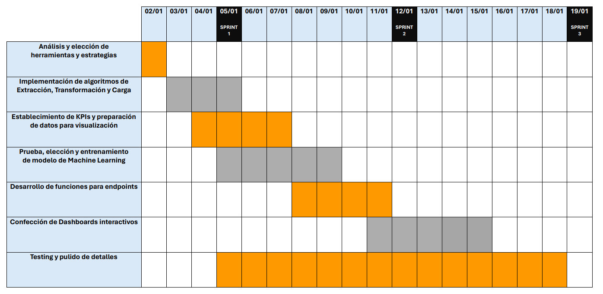

# **Trabajo local**

## `Inicio del proyecto:`

## Como primer fase del proyecto, realizamos un diagrama de Gantt para poder trazar objetivos y fechas de entrega.

## `EDA y ETL:`

## Teniendo los objetivos fijos, se llevó a cabo una exhaustiva exploración a nivel local con la finalidad de identificar la plataforma de computación en la nube más adecuada para la implementación posterior. Esta etapa inicial fue crucial para analizar las distintas opciones disponibles y evaluar sus capacidades en función de los requisitos del proyecto. Es importante destacar que el EDA y ETL inicial se encuentran en el notebook [`ETL`](1-ETL.ipynb) donde exploramos el contenido de los datasets provistos para de esta manera realizar una correcta elección de las columnas a utilizar y el tipo de dato de las mismas para evitar sesgos en el análisis posterior.

## `Web Scraping`

## Como siguiente paso, se aplicó web scraping a la página de la [Comisión de taxis y limusinas de New York](https://www1.nyc.gov/site/tlc/about/tlc-trip-record-data.page) para obtener los links de descarga de los datasets de viajes en taxi en el año 2023. Para ello, se utilizó la librería `BeautifulSoup` de Python. El código se encuentra en el notebook [`Web Scraping`](2-Web_Scraping.ipynb).

## `Segundo EDA`

## Con todos los archivos normalizados y listos, implementamos un segundo análisis exploratorio de datos para poder visualizar los datos de manera más clara y poder realizar un análisis más profundo. El código se encuentra en el notebook [`EDA`](3-EDA.ipynb).

## `Elección del Modelo de Machine Learning`

## Modelo: [XGBoost Regressor](4-ML_XGBRegressor.ipynb)

## **Motivación:**

### 1. **Capacidad para manejar relaciones no lineales:**
   - El XGBoost Regressor es un modelo de ensamble basado en árboles, lo que le permite capturar relaciones no lineales y patrones complejos en los datos. Dado que la demanda de taxis puede depender de factores no lineales, como eventos especiales o patrones de tráfico, un modelo flexible como XGBoost es adecuado.

### 2. **Regularización incorporada:**
   - XGBoost incluye técnicas de regularización que ayudan a prevenir el sobreajuste. Esto es crucial en nuestro escenario, ya que queremos un modelo que generalice bien a nuevos datos y no se ajuste demasiado a las particularidades del conjunto de entrenamiento.

### 3. **Manejo eficiente de datos faltantes:**
   - XGBoost puede manejar de manera eficiente los valores perdidos en los datos, lo cual es común en conjuntos de datos del mundo real. Esto es beneficioso para lidiar con posibles valores faltantes en nuestros datos de entrada.

### 4. **Escalabilidad:**
   - XGBoost es conocido por su capacidad de escalabilidad y rendimiento, lo que lo hace apto para manejar grandes conjuntos de datos. Dado que trabajamos con datos de distritos de Nueva York, la capacidad de escalabilidad es esencial para garantizar un entrenamiento y predicciones eficientes.

## Fórmula Matemática del XGBoost Regressor:

## El modelo XGBoost realiza predicciones mediante la suma ponderada de la salida de varios árboles de decisión débiles. La fórmula general se expresa como:

## \[ \hat{y}_i = \sum_{k=1}^{K} f_k(\mathbf{x}_i) \]

## Donde:
### - \( \hat{y}_i \) es la predicción para la observación \(i\).
### - \( K \) es el número total de árboles.
### - \( f_k \) es la predicción del árbol \(k\).

## Lógica de Uso:

### 1. **Entrenamiento:**
   - Utilizaremos datos históricos de demanda de taxis en Nueva York para entrenar nuestro modelo. Ajustaremos los hiperparámetros del XGBoost Regressor para optimizar el rendimiento del modelo.

### 2. **Predicción:**
   - Una vez entrenado, el modelo podrá realizar predicciones sobre la demanda de taxis en los distintos distritos. Utilizaremos características relevantes, como la hora del día, el día de la semana, eventos especiales, y datos de tráfico para hacer predicciones.

### 3. **Evaluación:**
   - Evaluaremos el rendimiento del modelo utilizando métricas como el error cuadrático medio (MSE) para asegurarnos de que nuestras predicciones sean precisas y generalicen bien a datos no vistos.

### 4. **Ajuste Fino:**
   - En caso necesario, realizaremos ajustes finos en los hiperparámetros del modelo para mejorar su rendimiento en situaciones específicas.

## Este enfoque, respaldado por las características y capacidades del XGBoost Regressor, nos permitirá desarrollar un modelo robusto y preciso para predecir la demanda de taxis en Nueva York, proporcionando información valiosa para la gestión eficiente de los recursos de transporte en la ciudad.

## `Endpoints`

## Con el modelo entrenado y los datasets normalizados se crearon funciones para el deploy de las mismas, trabajando tanto con los archivos en local ([Notebook Local Endpoints](5-Local_Endpoints.ipynb)) como en la plataforma de AWS ([Notebook AWS Endpoints](6-AWS_Endpoints.ipynb)). El deploy se realizó utilizando la librería FastAPI y el servicio Render.

## `Extra`

## Para finalizar y a modo de demostrar el alto potencial del equipo, se creó una aplicación para que las consultas a los endpoints sean amigables con usuarios no técnicos. Para ello se utilizó la librería Tkinter de Python mientras que el empaquetado puede realizarse con la librería Pyinstaller. El código se encuentra en el notebook [`App`](7-App_Test.ipynb)

## `Tecnologías utilizadas`

## `Para revisar:`

* Sitio web: [`Enlace`](https://taxisnyc.onrender.com/docs#)

## `Equipo`

* **`María Inés Hiriart` _(Data Analyst)_**   
* **`Santiago Ituyan` _(Data Analyst)_**   
* **`Jordi Segarra` _(Data Scientist)_**   
* **`Leopoldo Farah` _(Data Engineer)_**   
* **`Osvaldo Gabriel Sosa` _(Data Engineer)_**   