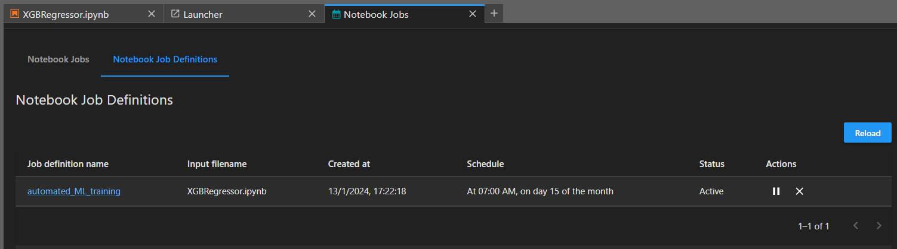

# **Implementación de servicios de Amazon Web Services**

## [AWS Lambda](https://aws.amazon.com/es/pm/lambda/?gclid=Cj0KCQiAnfmsBhDfARIsAM7MKi3hA_kpcaFxoJcsHGFQ6Csz1HOeFl6fqBFCYpECIED_WyPmMUSeVjwaApFrEALw_wcB&trk=91e64750-b4c8-4c8d-8ab0-9f93b6d03e96&sc_channel=ps&ef_id=Cj0KCQiAnfmsBhDfARIsAM7MKi3hA_kpcaFxoJcsHGFQ6Csz1HOeFl6fqBFCYpECIED_WyPmMUSeVjwaApFrEALw_wcB:G:s&s_kwcid=AL!4422!3!651510248553!e!!g!!aws%20lambda!19828212861!147446016415) es un servicio de computación sin servidor que nos permite ejecutar código sin aprovisionar ni administrar servidores. Podemos ejecutar código para prácticamente cualquier tipo de aplicación o servicio backend con tolerancia a errores o administración de recursos de computación. Solo tenemos que cargar el código y `Lambda` se encargará de todo lo necesario para ejecutar y escalar el código con alta disponibilidad. Podemos configurar el código para que se ejecute automáticamente desde otras fuentes (como S3, SNS, DynamoDB o Kinesis) sin necesidad de crear un punto de enlace. También podemos usar Lambda para crear nuevos servicios que se activen de forma directa o periódica.

## En esta primer estapa, creamos una función `Lambda` que se encarga de realizar web scrapping a la página [Taxi & Limousine Comission](https://www.nyc.gov/site/tlc/about/tlc-trip-record-data.page) para extraer los datos de los viajes realizados en la ciudad de New York durante el año 2023 y finalmente almacenarlos en un bucket de [AWS S3](https://aws.amazon.com/es/s3/).

## A efectos de automatizar el proceso se utilizó [AWS EventBridge](https://aws.amazon.com/es/eventbridge/) para programar la ejecución de la función `Lambda` el día 15 de cada mes a las 00:00 hs.

## Una vez obtenidos los archivos parquet, recurrimos al uso de [AWS Glue](https://aws.amazon.com/es/glue/) para automatizar el proceso de normalización de los datos.
## [AWS Glue](https://aws.amazon.com/es/glue/) es un servicio de extracción, transformación y carga (ETL) totalmente administrado que facilita la preparación y la carga de los datos para su análisis. Podemos crear y ejecutar trabajos de ETL con unos pocos clics en la consola de AWS o directamente ejecutar el código en Apache Spark para aprovechar los beneficios de escala, seguridad y administración.

## Para automatizar el proceso de normalización de los datos, se utilizó [AWS EventBridge](https://aws.amazon.com/es/eventbridge/) para programar la ejecución de la tarea de [AWS Glue](https://aws.amazon.com/es/glue/) el día 15 de cada mes a las 01:00 hs.

## Una vez que se completa la normalización de los datos, se guarda el archivo resultante en formato Parquet en un bucket de [AWS S3](https://aws.amazon.com/es/s3/). Sin embargo, el archivo se guarda con el nombre predeterminado `part-00000-8bbda55c-fad7-46b5-9f8d-b8d8e336c149-c000.snappy.parquet`. Este nombre se genera automáticamente cuando se guarda un archivo Parquet utilizando Apache Spark con el formato de compresión Snappy.
## Para solucionar este problema, utilizamos otra función `Lambda` para renombrar el archivo y almacenarlo en un bucket que alimenta a nuestro `Data Warehouse`.

## La automatización de este proceso se realiza mediante otro evento de [AWS EventBridge](https://aws.amazon.com/es/eventbridge/) que se ejecuta el día 15 de cada mes a las 02:00 hs.

### Una vez que el archivo se encuentra en el bucket que nutre a [AWS Athena](https://aws.amazon.com/es/athena/), podemos realizar consultas SQL para obtener información de los datos almacenados en el `Data Warehouse` como así también utilizar la librería PyAthena para hacer consultas desde Python y así crear aplicaciones o sitios web que utilicen el database para arrojar resultados. 
### Conforme la base de datos de TLC se renueve, nuestro `Data Warehouse` y todos los servicios de AWS que dependan de él, se actualizarán automáticamente mediante nuestra función `Lambda` que tomará los nuevos registros de viajes y los almacenará en el bucket del `Data Warehouse`.

### Para visualizar los datos almacenados en el `Data Warehouse`, utilizamos [AWS Quicksight](https://aws.amazon.com/es/quicksight/), un servicio de inteligencia de negocios (BI) que nos permite crear y publicar paneles interactivos que contienen visualizaciones de datos en tiempo real. Podemos acceder a los paneles desde cualquier dispositivo y compartirlos fácilmente con otras personas en nuestra organización.

### También optamos por utilizar [Power BI](https://powerbi.microsoft.com/es-es/) para visualizar los datos almacenados en el `Data Warehouse` mediante el uso del conector certificado Simba Athena, en caso de querer replicar la conexión, les dejamos un [enlace](https://youtu.be/FKdCr6vmq-o?si=Bj6FZcRKV-jMitg0) explicando el proceso y el [`dashboard`](https://drive.google.com/file/d/1PoAHQCPmF1hUL2V2shqlKUWhdLIcGK3d/view?usp=sharing) para su descarga y visualización.

### El entrenamiento del modelo de Machine Learning se realiza mediante [AWS Sagemaker](https://aws.amazon.com/es/sagemaker/), un servicio completamente administrado que nos permite crear, entrenar e implementar de forma rápida y sencilla modelos de Machine Learning a cualquier escala. Podemos crear modelos de Machine Learning personalizados con cualquier algoritmo de aprendizaje y luego implementarlos en producción en pocos clics. Podemos usar todos los algoritmos de aprendizaje automático más populares, como clasificación, regresión, agrupación, detección de anomalías, recomendación y aprendizaje profundo.

### La automatización del entrenamiento del modelo de Machine Learning se realiza mediante un evento programado en [AWS Sagemaker](https://aws.amazon.com/es/sagemaker/) que se ejecuta el día 15 de cada mes a las 04:00 hs (GMT -3).

### Por último, utilizamos [Render](https://render.com/) para crear un sitio web que nos permita visualizar los datos almacenados en el `Data Warehouse` mediante consultas SQL. Render es un servicio de alojamiento web que nos permite crear sitios web estáticos y dinámicos, aplicaciones web y API. Render se encarga de todo lo necesario para ejecutar y escalar el código con alta disponibilidad. Solo tenemos que cargar el código y Render se encargará de todo lo demás. El siguiente [enlace](https://taxisnyc.onrender.com/docs#) permite probar el modelo de recomendación de viajes en taxi y estadísticas de los mismos.

## `Tecnologías utilizadas`

## `Para revisar:`

* Video explicativo: [`Visualización`](https://youtu.be/YW84_oF6xfg) - [`Descarga`](https://drive.google.com/file/d/131HWUANNzo8jws4DfGNWMEnNLFjTYTvJ/view?usp=drive_link)
* Dashboard: [`Descarga`](https://drive.google.com/file/d/1PoAHQCPmF1hUL2V2shqlKUWhdLIcGK3d/view?usp=sharing)
* Sitio web: [`Enlace`](https://taxisnyc.onrender.com/docs#)

## `Equipo`

* **`María Inés Iriart` _(Data Analyst)_**   
* **`Santiago Ituyan` _(Data Analyst)_**   
* **`Jordi Segarra` _(Data Scientist)_**   
* **`Leopoldo Farah` _(Data Engineer)_**   
* **`Osvaldo Gabriel Sosa` _(Data Engineer)_**   