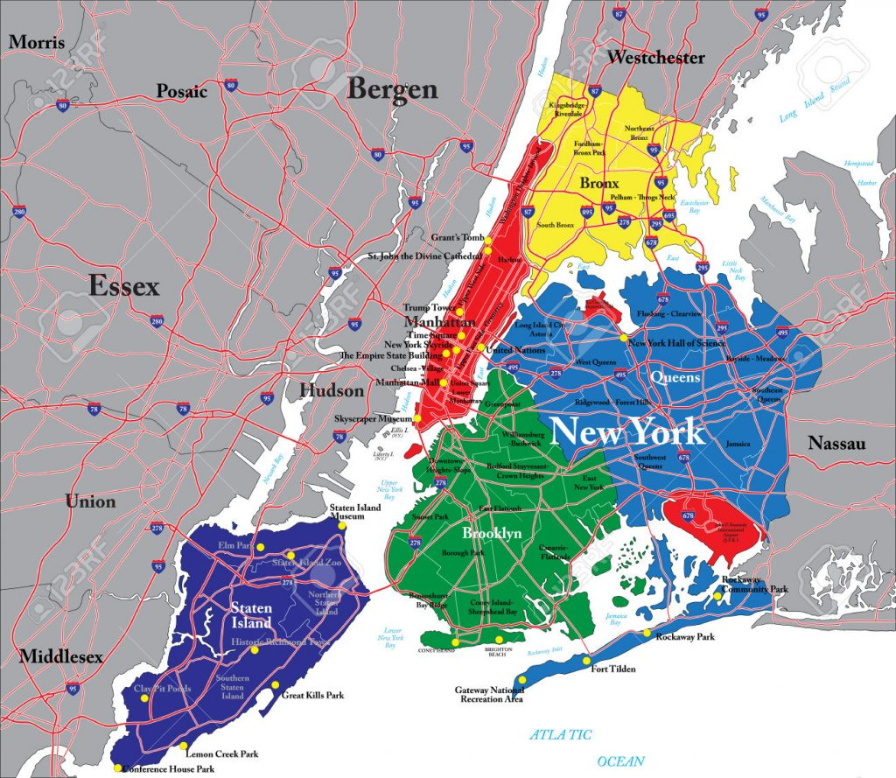
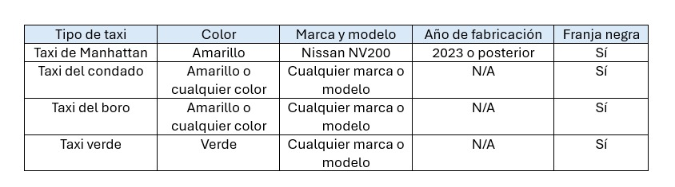
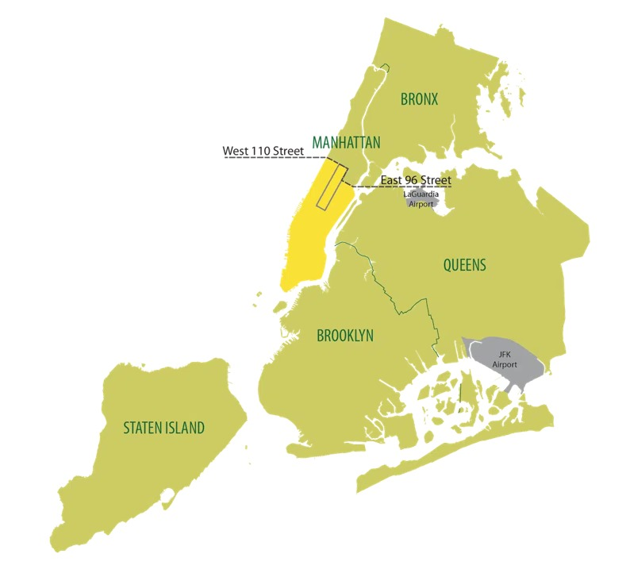
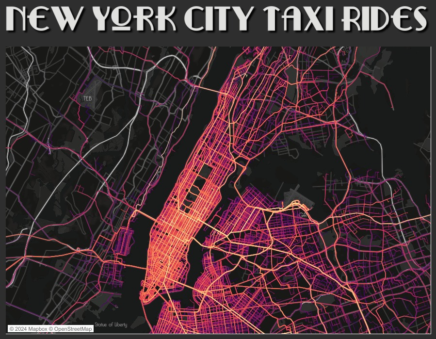

# **NYC Taxis & CO2 Emissions**

### `Contexto`

En un mundo cada vez más consciente de la importancia de la sostenibilidad y la reducción de la contaminación ambiental, una nueva empresa de taxis está decidida a tomar medidas significativas. Su enfoque se centra en la inversión de vehículos eléctricos como una forma de reducir las emisiones de dióxido de carbono (CO2) y, al mismo tiempo, buscar beneficios económicos mediante la eficiencia de costos.

Para lograr este objetivo, la empresa ha recurrido a nuestra consultora. La misión es evaluar exhaustivamente los datos relacionados con la operación de taxis, las emisiones de CO2 y las tendencias del mercado de vehículos eléctricos. Este análisis permitirá a la empresa tomar decisiones informadas que contribuyan a la reducción de la contaminación y, al mismo tiempo, maximizar sus beneficios económicos.

A través de la exploración de datos y el análisis de tendencias, esperamos aportar soluciones significativas que beneficien tanto a la empresa como al medioambiente.

## 🚀 `¿Quiénes somos?`

Datagnius es una consultora especializada en análisis, ciencia e ingeniería de datos, dedicada a potenciar decisiones estratégicas que maximicen las ganancias de nuestros clientes. Con un compromiso inquebrantable hacia la excelencia y el perfeccionismo en los detalles, hemos liderado proyectos exitosos en diversos sectores.

Impulsados por nuestra visión de un futuro más sostenible y alineados con las tendencias del mercado, exploramos activamente la relación entre los datos y las oportunidades de negocio. Nuestra misión es proporcionar insights valiosos que permitan a las empresas tomar decisiones informadas y rentables.

En Datagnius contamos con un equipo de profesionales especializados en análisis de datos, machine learning y tecnologías cloud. Nos dedicamos a desbloquear el potencial de los datos para que empresas, como la tuya, avancen hacia el futuro con confianza y éxito.

## `Roles`

En nuestra consultora contamos con 3 roles fundamentales
 - **Data Analyst:** Son los responsables de extraer, limpiar, analizar y presentar datos de una manera significativa para tomar decisiones informadas. En esta ultima tarea, nuestros analistas son los encargados de crear y presentar las visualizaciones previstas para que el cliente pueda entender cual fue nuestro analisis. 
 Contamos con dos profesionales:
    - Maria Ines Hiriart Beracochea
    - Santiago Ituyan
 - **Machine Learning:** El responsable de este rol es el encargado del desarrollo de modelos de machine learning y la implementación de soluciones basadas en inteligencia artificial para mejorar la toma de decisiones y automatizar procesos.
 Contamos con un profesional:
    - Jordi Mikel Segarra Guerra
- **Data Engineer:** Los responsables de este rol se encargan de diseñar, implementar y mantener las infraestructuras de datos y la automatizacion de pipelines que permiten la recopilación, procesamiento y almacenamiento eficiente de los datos dentro de la nube.
Contamos con dos profesionales:
    - Gabriel Osvaldo Sosa
    - Leopoldo Martin Farah Cometti

Cada uno de estos roles es fundamental para el éxito de nuestro proyecto, y juntos trabajamos en colaboración para garantizar la calidad y la utilidad de los datos que manejamos, así como para aprovechar el potencial del machine learning en nuestro proyecto.
    

### `Objetivos`

Nuestra consultora se ha comprometido a contribuir al proceso de toma de decisiones de esta empresa mediante la realización de los siguientes objetivos:

- **Recopilación y Depuración de Datos:** En primer lugar, nos enfocaremos en la recopilación y depuración de datos de diversas fuentes. Esto incluirá información sobre la operación de taxis en la ciudad de Nueva York, las emisiones de CO2 asociadas a diferentes modelos de automóviles, la contaminación sonora de los vehiculos, la disponibilidad de estaciones de carga para vehículos eléctricos y otros conjuntos de datos relevantes.

- **Creación de un sistema de automatización alojado en la nube:** Con la colaboración de Amazon Web Services, nos comprometemos a desarrollar un pipeline que facilitará el almacenamiento de todos los datos en la nube con actualizaciones automáticas, según la conveniencia del cliente. De este modo, el cliente dispondrá siempre de acceso a la información deseada sin tener que preocuparse por su actualización

- **Desarrollo de un Dashboard Interactivo:** Propondremos un panel interactivo que posibilitará a los interesados explorar el análisis de valor, centrándose en los KPI (Indicadores Clave de Desempeño) que hemos establecido.

- **Implementación de un Modelo de Machine Learning:** Desarrollaremos un modelo de machine learning con el objetivo de predecir la probabilidad de que un taxi consiga un pasajero, considerando el lugar, la hora y el día en el que se encuentre. En una segunda fase, ajustaremos el modelo para proporcionar un listado de los tres vehículos ecológicos más adecuados, considerando el capital que el cliente desea invertir. Esta recomendación tomará en cuenta el precio del vehículo, el tipo de combustible, las emisiones de CO2, la cantidad de decibelios emitidos por el motor y, por último, la eficiencia del tanque en términos de millas recorridas

## `Tecnologías`

## `Descripción general`

Después de realizar una exhaustiva búsqueda de información relevante, nuestra consultora optó por realizar web scraping en la página oficial de la Comisión de Taxis y Limusinas de la ciudad de Nueva York. Este proceso nos proporcionó datos sobre todos los viajes de taxis en los diversos distritos de la ciudad durante el año 2023. El conjunto de datos resultante fue analizado en detalle por nuestro equipo de analistas de datos con el objetivo de extraer información valiosa para el negocio de nuestro cliente.

Tras analizar esta información, se decidió utilizar otro conjunto de datos proporcionados por el equipo de Soy Henry. Este conjunto de datos aborda los distintos tipos de vehículos que podrían funcionar como taxis, junto con otros conjuntos de datos relacionados con la contaminación. De esta manera, logramos integrar una idea de negocio que beneficiará no solo al cliente, sino también al medio ambiente.

Procedemos a explicar el analisis de los viajes de taxis dentro de la ciudad de Nueva York. Como podemos observar en la siguiente imagen, la ciudad se reparte en 5 distritos diferentes los cuales son Manhattan, Brooklyn, Staten Island, The Bronx y Queens.
 

Es importante tener en cuenta estos distritos, ya que nuestro análisis se centra principalmente en el distrito más congestionado: Manhattan. Después de estudiar detalladamente el papel de los taxis en la ciudad de Nueva York, llegamos a la conclusión de que esta congestión se debe principalmente a que el distrito de Manhattan es el punto central de la ciudad, donde se encuentra el epicentro de la economía de Estados Unidos. Por esta razón, la mayor cantidad de viajes de taxis se producen dentro de este distrito.

Antes de continuar, es necesario que expliquemos el contexto histórico de los taxis en la Gran Manzana. Los famosos taxis amarillos son un símbolo en la ciudad de Nueva York desde el año 1937. En este año se creó el sistema de medallas de taxis, cuyo objetivo era proporcionar un vehículo reconocido por sus famosas medallas para el público. No fue hasta el año 1996 que la ciudad incorporó más cantidad de taxis a su flota. Sin embargo, a pesar de que había más taxis, persistía un problema grave: en los distintos distritos de la ciudad, estos vehículos no estaban disponibles, y solo era posible conseguir un viaje si estabas en Manhattan.

Frente a esta problemática, en el año 2013 se optó por añadir otro tipo de taxis que se desplazarían principalmente por el resto de los distritos. Así nacieron los taxis verdes o "boro taxis" (taxis de borough). Este tipo de taxis tenían permitido recoger a personas fuera del distrito de Manhattan, siendo su única restricción la recogida de viajes dentro de ese distrito. En el año 2014, en un contexto de creciente preocupación por la contaminación ambiental, la marca Nissan ganó el concurso 'El taxi del mañana' con su modelo NV200. El objetivo era simple: reemplazar los modelos existentes de taxis por el modelo de Nissan que cumplía con las normas ambientales. Desde ese año hasta la actualidad, cada taxi debe cumplir con estas normas y contribuir al medio ambiente.

Ya habiendo comentado la historia de los taxis, es importante explicar por qué nuestro análisis está basado en los taxis amarillos. Estos taxis conforman casi el 90% de la cantidad total de viajes, y esto se debe principalmente al lugar de incidencia. A los taxis amarillos se les permite iniciar un viaje solo dentro del distrito de Manhattan, y según nuestro análisis, cada taxi tiene un promedio de 4 viajes por hora, debido a la corta distancia que implican estos trayectos. En la siguiente imagen, se puede observar la disposición de los taxis amarillos con respecto al distrito de Manhattan.

Para ser un poco más representativos, los invitamos a que observen la siguiente imagen, donde se puede apreciar el recorrido de los taxis en la ciudad de Nueva York. De esta manera, comprenderán por qué nuestro objetivo fue centrarnos principalmente en el distrito de Manhattan. Nótese que las líneas de color representan el recorrido de cada viaje de taxi, y cuanto más "iluminada" esté la zona, sugiere que más taxis utilizan esa área. 

Sin mucho más que explicar, en este repositorio encontrarán DOS carpetas. Una corresponde al trabajo en local y la otra corresponde al trabajo utilizando Amazon Web Services. Esperamos que sea de su agrado. ¡Muchas gracias por leer hasta este punto!

